# SonarQube

## Descripcion

Implementación de la plataforma SonarQube en un contenedor de docker para realizar la evaluación de código de un repositorio en local.

## Implementacion

### Requerimientos

Es necesario instalar docker en nuestro sistema operativo antes de iniciar con la implementacion

* Docker 
    * [Docker para Windows](https://docs.docker.com/desktop/install/windows-install/)
    * [Docker para Linux](https://docs.docker.com/desktop/install/linux-install/)
    * [Docker para Mac](https://docs.docker.com/desktop/install/mac-install/)

### Instalar SonarQube

Por un lado, para ejecutar SonarQube como contenedor podemos hacer uso del comando:

```
docker run -d --name sonarqube -p 9000:9000 -v sonarqube_data:/opt/sonarqube/data sonarqube
```

_Nota: Al ejecutar este comando solo se asegura la persistencia de parte de los datos del contenedor en caso de falla._

Por otro lado, también se puede hacer uso de un archivo como el [docker-compose.yml](docker-compose.yml) para ejecutar tanto el servicio de SonarQube como la base de datos que se necesita para este.

```
version: '2'

services:
  sonarqube:
    image: sonarqube
    ports:
      - "9000:9000"
    networks:
      - sonarnet
    environment:
      - SONARQUBE_JDBC_URL=jdbc:postgresql://db:5432/sonar
      - SONARQUBE_JDBC_USERNAME=sonar
      - SONARQUBE_JDBC_PASSWORD=sonar
    volumes:
      - sonarqube_conf:/opt/sonarqube/conf
      - sonarqube_data:/opt/sonarqube/data
      - sonarqube_extensions:/opt/sonarqube/extensions
      - sonarqube_bundled-plugins:/opt/sonarqube/lib/bundled-plugins

  db:
    image: postgres
    networks:
      - sonarnet
    environment:
      - POSTGRES_USER=sonar
      - POSTGRES_PASSWORD=sonar
    volumes:
      - postgresql:/var/lib/postgresql
      - postgresql_data:/var/lib/postgresql/data

networks:
  sonarnet:
    driver: bridge

volumes:
  sonarqube_conf:
  sonarqube_data:
  sonarqube_extensions:
  sonarqube_bundled-plugins:
  postgresql:
  postgresql_data:

```

_Nota: Al ejecutar este archivo se asegura la persistencia de los datos del contenedor en caso de falla._

* Para levantar los contenedores usando compose es necesario ejecutar el comando ``docker-compose up -d``

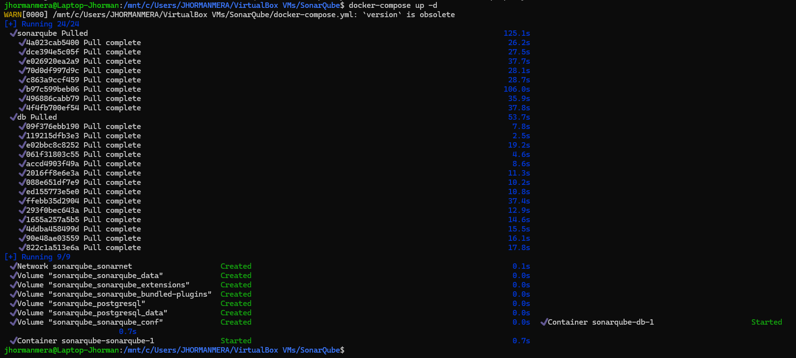

* Para detener los contenedores sin eliminarlos usa ```docker-compose stop``
* Para eliminar todos los contenedores de la implementacion manteniendo los volumenes y las imagenes descargadas se usa ``docker-compose down``
* Para ver otros comandos disponibles usa ``docker-compose --help``

### Dentro de SonarQube

Ingresamos a sonar por la url `localhost:9000`, las credenciales de autenticación por defecto son Login: `admin` y Password: `admin`

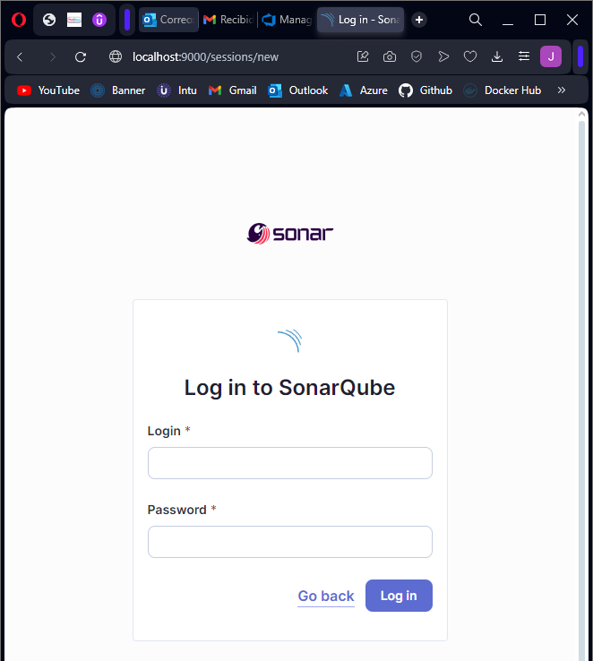

Se debe cambiar la contraseña por defecto antes de continuar utilizando la plataforma

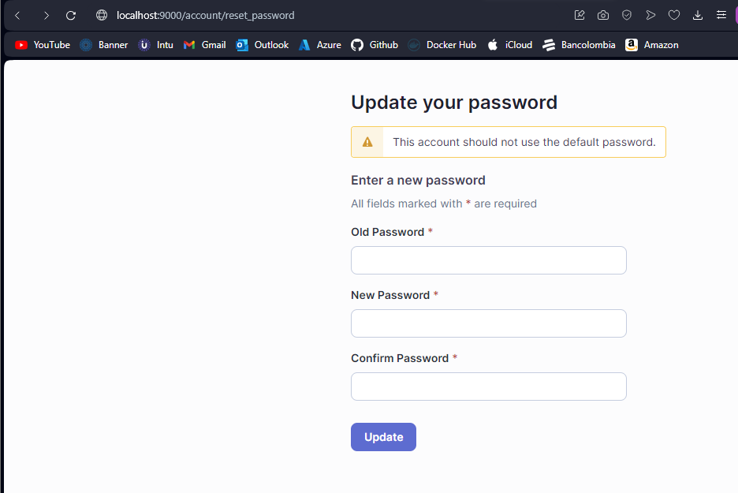

Crear un peoyecto local, también se pueden crear proyectos con repositorios fuentes desde diferentes plataformas como Azure DevOps, Github, Gitlab y Bitbucket

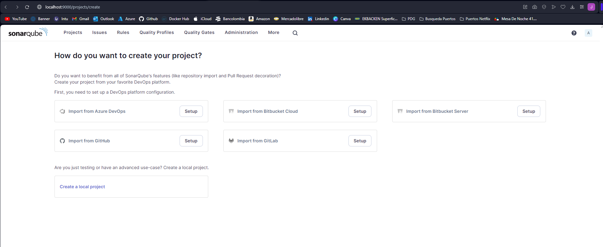

Asignar nombre, llave y definir la rama principal del proyecto ya que esta rama será la que se va a revisar posteriormente. Luego, usar la configuación global (Por defecto) y escoger el método de análisis local para el proyecto

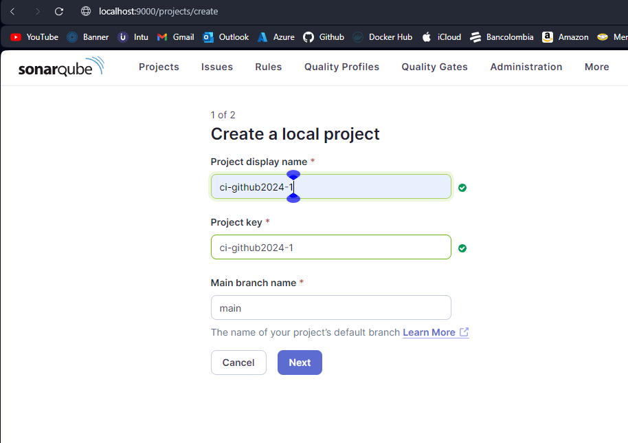
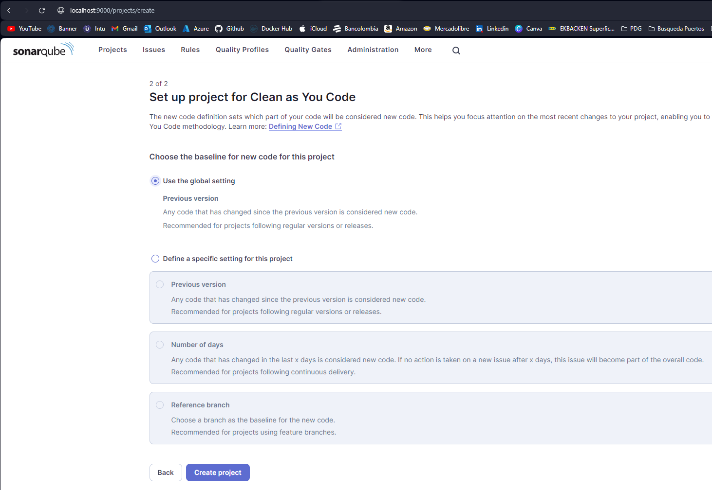
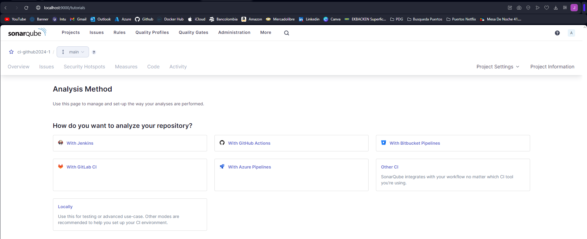

Generar el token de autenticación para realizar los análisis de código del proyecto y luego seleccionamos el sistema operativo donde ejecutaremos el Sonar-Scanner para realizar la instalación de su CLI

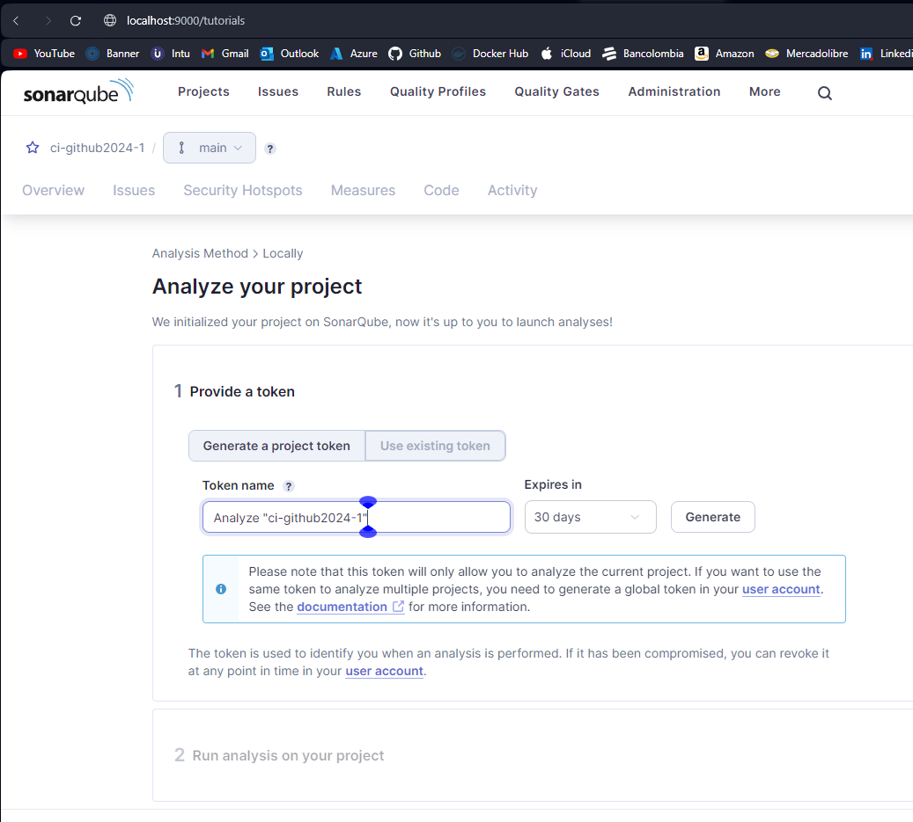

_Nota: Este token solo es válido en este proyecto, también se puede crear un token global desde la configuración de la cuenta_

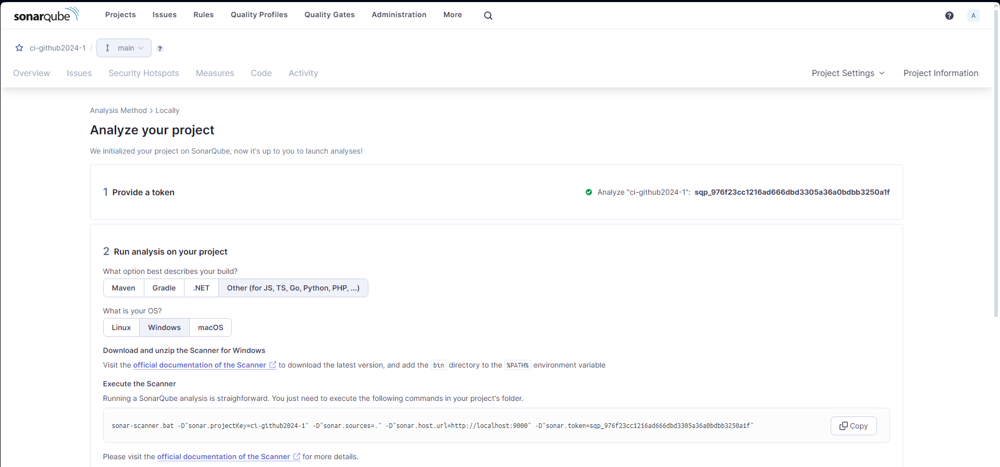

_Nota: Antes de continuar se debe instalar Sonar-Scanner en el sistema y agregarlo a las variables de entorno del mismo_

## Instalar Sonar-Scanner en Linux

Para esta parte, es necesario tener `wget` y `unzip` instalados los cuales se pueden instalar ejecutando `

```
sudo apt update
sudo apt upgrade
sudo apt install wget
sudo apt install unzip
```
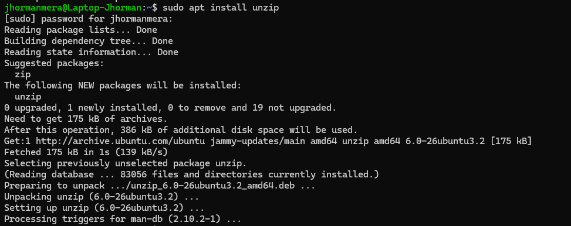

Descargar y descomprimir la carpeta comprimida de la última versión de Sonar-Scanner

* Verificar la url de descarga en la [pagina de Sonar-Scanner CLI](https://docs.sonarsource.com/sonarqube/latest/analyzing-source-code/scanners/sonarscanner/)

`wget https://binaries.sonarsource.com/Distribution/sonar-scanner-cli/sonar-scanner-cli-5.0.1.3006-linux.zip`

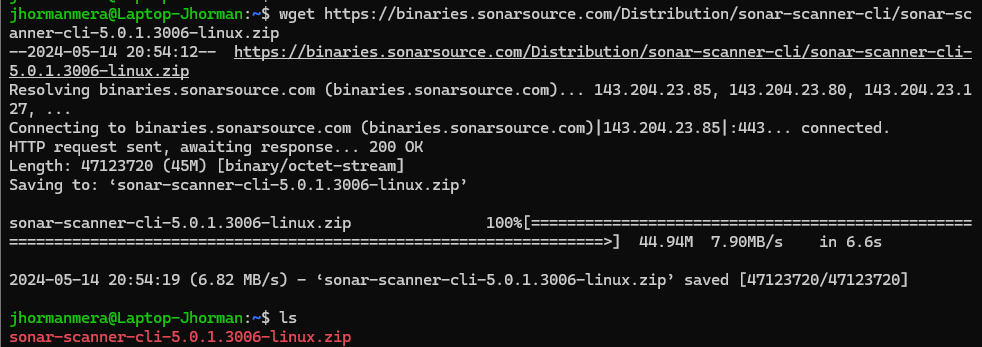
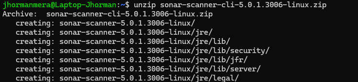

Mover la carpeta descomprimida a `/Opt/Sonar-Scanner` y eliminar el archivo .zip descargado

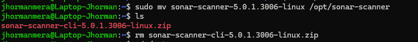

 Crear un enlace simbolico y agregar la ruta `/opt/sonar-scanner/bin` a las variables de entorno para poder hacer uso del comando `sonar-scanner`

 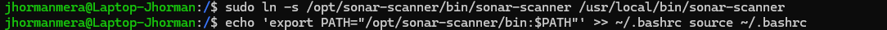

Ejecutar el escaner dentro de la carpeta raiz del proyecto y esperar que se realicen las verificaciones hasta que se recargue la página del dashboard y se muestre el resultado del análisis

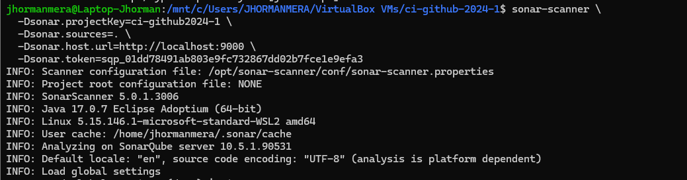
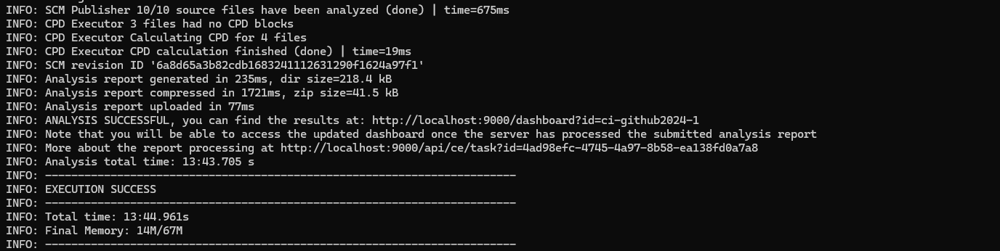
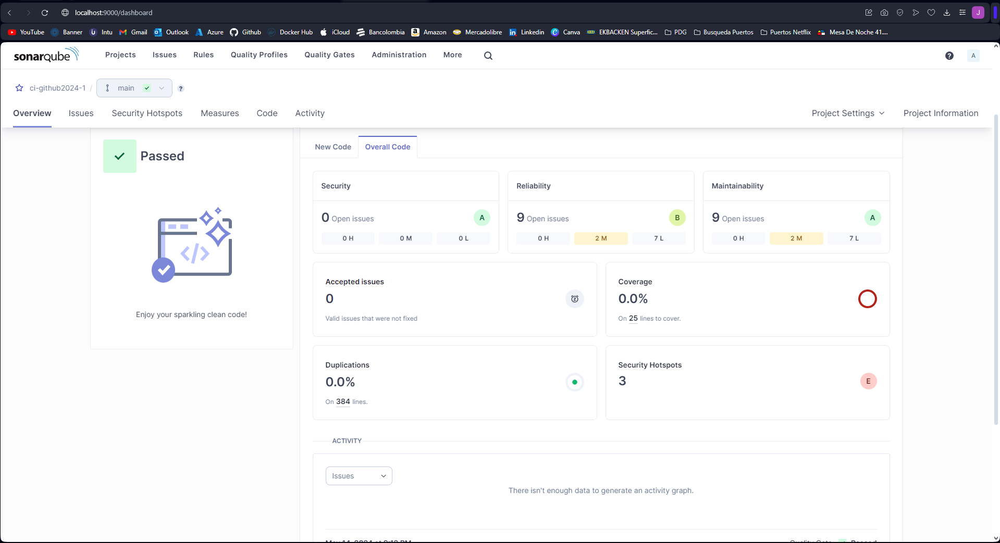

SonarQube tiene la capacidad de mostrar alertas en el código y dar recomendaciones para corregirlo seguido de una explicación detallada de todo el análisis

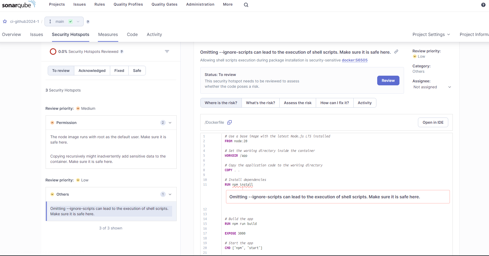
